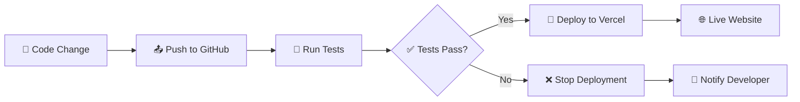

# 🚀 Автоматичний деплой на Vercel через GitHub

Ця інструкція допоможе налаштувати автоматичний деплой вашого веб-чату на Vercel при кожному push до GitHub репозиторію.

## 📋 Кроки налаштування

### 1. 📦 Підготовка GitHub репозиторію

```bash
# Ініціалізація Git (якщо ще не зроблено)
git init

# Додавання всіх файлів
git add .

# Створення першого коміту
git commit -m "🎉 Initial commit: Gym Gays CV Web Chat"

# Підключення до GitHub репозиторію
git remote add origin https://github.com/YOUR_USERNAME/YOUR_REPO_NAME.git

# Відправка коду на GitHub
git push -u origin main
```

### 2. 🔗 Підключення Vercel до GitHub

1. **Відкрийте [Vercel Dashboard](https://vercel.com/dashboard)**
2. **Натисніть "New Project"**
3. **Оберіть "Import Git Repository"**
4. **Знайдіть ваш GitHub репозиторій**
5. **Натисніть "Import"**

### 3. ⚙️ Налаштування змінних оточення в Vercel

В налаштуваннях проекту додайте змінні:

```bash
BOT_TOKEN=your_telegram_bot_token
GOOGLE_SHEETS_ID=your_google_sheets_id
GOOGLE_SERVICE_ACCOUNT_EMAIL=your_service_account_email
GOOGLE_PRIVATE_KEY=your_private_key
```

### 4. 🔑 Налаштування GitHub Secrets

Для роботи GitHub Actions потрібно додати секрети:

1. **Перейдіть в ваш GitHub репозиторій**
2. **Settings → Secrets and variables → Actions**
3. **Додайте наступні секрети:**

#### Обов'язкові секрети:
```bash
VERCEL_TOKEN=your_vercel_token
VERCEL_ORG_ID=your_vercel_org_id
VERCEL_PROJECT_ID=your_vercel_project_id
```

#### Як отримати ці значення:

**VERCEL_TOKEN:**
1. Vercel Dashboard → Settings → Tokens
2. Створіть новий token
3. Скопіюйте значення

**VERCEL_ORG_ID і VERCEL_PROJECT_ID:**
1. В терміналі в папці проекту:
   ```bash
   npx vercel
   ```
2. Файл `.vercel/project.json` містить ці ID

### 5. 🚀 Перший автоматичний деплой

Після налаштування просто зробіть push:

```bash
git add .
git commit -m "✨ Add new feature"
git push origin main
```

Деплой запуститься автоматично! 🎉

## 📊 Моніторинг деплою

### GitHub Actions
- Переглядайте процес в розділі **Actions** вашого репозиторію
- Кожен push створює новий workflow run
- Статус: ✅ Success / ❌ Failed

### Vercel Dashboard
- Всі деплої відображаються в Vercel Dashboard
- Логи та статистика доступні в реальному часі
- Автоматичні preview для pull requests

## 🔄 Workflow процес



## 🛠 Налаштування workflow файлів

### Основні файли:
- `.github/workflows/deploy.yml` - Автоматичний деплой
- `.github/workflows/test.yml` - Тестування та перевірка якості

### Кастомізація:

#### Зміна гілок для деплою:
```yaml
on:
  push:
    branches: [ main, production, staging ]
```

#### Додавання нових кроків тестування:
```yaml
- name: 🧪 Custom Test
  run: npm run test:custom
```

#### Налаштування сповіщень:
```yaml
- name: 📧 Notify Success
  if: success()
  uses: 8398a7/action-slack@v3
  with:
    status: success
    webhook_url: ${{ secrets.SLACK_WEBHOOK }}
```

## 🔧 Налаштування середовищ

### Production (main branch)
- Автоматичний деплой на production домен
- Повний набір тестів
- Сповіщення про успіх/помилки

### Staging (develop branch)
```yaml
on:
  push:
    branches: [ develop, staging ]
```

### Preview (Pull Requests)
- Автоматичне створення preview URL
- Тестування змін перед merge
- Коментарі в PR з посиланням на preview

## 📱 Мобільні сповіщення

Налаштуйте сповіщення про статус деплою:

### Slack Integration:
```yaml
- name: 📢 Slack Notification
  if: always()
  uses: 8398a7/action-slack@v3
  with:
    status: ${{ job.status }}
    channel: '#deployments'
    webhook_url: ${{ secrets.SLACK_WEBHOOK }}
```

### Discord Integration:
```yaml
- name: 🎮 Discord Notification
  if: always()
  uses: sarisia/actions-status-discord@v1
  with:
    webhook: ${{ secrets.DISCORD_WEBHOOK }}
    status: ${{ job.status }}
```

### Email Notifications:
```yaml
- name: 📧 Email Notification
  if: failure()
  uses: dawidd6/action-send-mail@v3
  with:
    server_address: smtp.gmail.com
    server_port: 465
    username: ${{ secrets.EMAIL_USERNAME }}
    password: ${{ secrets.EMAIL_PASSWORD }}
    subject: "❌ Deployment Failed"
    to: your@email.com
    from: github-actions@yourproject.com
```

## 🐛 Відладка проблем

### Часті помилки:

1. **Vercel token невалідний**
   ```
   Error: Invalid token
   ```
   **Рішення:** Перегенеруйте VERCEL_TOKEN

2. **Змінні оточення не знайдені**
   ```
   Error: BOT_TOKEN is not defined
   ```
   **Рішення:** Додайте змінні в Vercel Dashboard

3. **Build неуспішний**
   ```
   Error: Build failed
   ```
   **Рішення:** Перевірте логи в GitHub Actions

### Корисні команди для відладки:

```bash
# Локальний тест деплою
npx vercel --prod

# Перевірка синтаксису
node -c api/telegram.js
node -c api/chat.js

# Тест dev server
npm run dev
```

## 📈 Оптимізація workflow

### Кешування залежностей:
```yaml
- name: 📦 Cache Node modules
  uses: actions/cache@v3
  with:
    path: ~/.npm
    key: ${{ runner.os }}-node-${{ hashFiles('**/package-lock.json') }}
```

### Паралельне виконання:
```yaml
strategy:
  matrix:
    node-version: [16, 18, 20]
```

### Умовний деплой:
```yaml
- name: 🚀 Deploy
  if: contains(github.event.head_commit.message, '[deploy]')
```

## 🎯 Результат

Після правильного налаштування:

✅ **Автоматичний деплой** при push до main  
✅ **Тестування** перед деплоєм  
✅ **Preview** для pull requests  
✅ **Сповіщення** про статус  
✅ **Логи** та моніторинг  

## 🔗 Корисні посилання

- [Vercel GitHub Integration](https://vercel.com/docs/concepts/git)
- [GitHub Actions Documentation](https://docs.github.com/en/actions)
- [Vercel CLI Reference](https://vercel.com/docs/cli)
- [GitHub Secrets](https://docs.github.com/en/actions/security-guides/encrypted-secrets)

---

**🎉 Готово! Тепер ваш проект автоматично деплоїться при кожному push!** 

Насолоджуйтесь безперебійним workflow та зосередьтеся на розробці! 🚀💻 